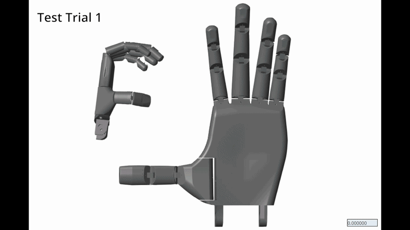

# 2020 International Brain Competition dataset4
raw data : https://osf.io/pq7vb/overview?view_only=08e7108d89fd42bab2adbd6b98fb683d  
From a 3-Grasping-Task Classification Problem to a Hand Joint Angle Prediction Problem  

# Hand.slx
공개된 3D hand 파일을 이용하여 Simulink에서 hand model을 조립.  

전체 Simulink 구성  

손가락 관절의 Simulink 구성  

# Demo
intro.ipynb에서 PyTorch 기반 CNN 모델을 이용하여 EEG 신호를 학습하였다.

이후 ModelLoadTest.py에서 학습된 모델을 불러와 16개 관절각을 예측하고, 예측값을 TCP/IP 통신을 통해 Simulink로 전송하였다.

